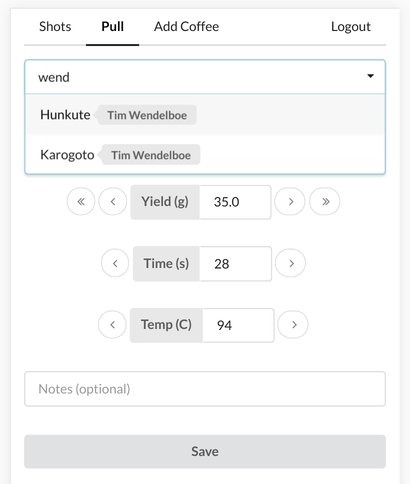

# dialin

This is a simple web app written in Haskell which allows users to manage and improve ("dial in") their espresso shots.

It uses the Snap framework for the backend, Persistent/Esqueleto for persistence, Servant for the API definitions and Reflex for the frontend. Building and deployment to AWS is done using Nix.

## Building

Use `nix-shell -A shells.ghc dialin.nix` to enter a nix-shell sandbox that provides you with cabal and all the required dependencies. Then, use `cabal new-build backend` to build the backend or `cabal new-build frontend` to build the GHC version of the frontend. This also allows for incremental builds and faster development cycles.

To build the frontend using GHCJS for deployment, use `nix-build dialin.nix -o frontend-ghcjs-result -A ghcjs.frontend`.

## Deployment

Nix is set up to deploy the app to an EC2 instance on AWS. It expects the file `~/.ec2-keys` to contain a valid EC2 key pair matching the access key ID in `dialin-ec2.nix`.

To create a deployment, use `nixops create ./dialin-configuration.nix ./dialin-ec2.nix -d dialin`. `nixops deploy -d dialin` will then deploy the app to the instance. Note that the initial deployment will take a relatively long time, while subsequent deployments are fairly quick. To update the deployment without starting from scratch, simply use `nixops modify ./dialin-configuration.nix ./dialin-ec2.nix -d dialin`.

## Screenshots

### Pulling a shot

### Viewing shots

